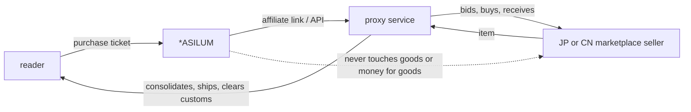

# PROXY SITE INTEGRATION — the map

**Owner instruction, 12 September 2026: "create a map to start proxy site
integration."** This is the route from where the code actually stands to a
working proxy source. It does not repeat `docs/JAPAN-INGESTION.md`, which
argues the Japanese case and documents the reader that is already built; it
maps the seams, the gates and the first move.

---

## 1. What a proxy is in this system

A **proxy shopping service** buys a domestic listing on a customer's behalf,
receives it, and forwards it internationally. Buyee, ZenMarket, Neokyo, FromJapan
and Jauce do this for Yahoo! JAPAN Auctions, Mercari JP and Rakuma; the Chinese
agents do it for Taobao and Weidian.

The strategic point, already argued and ruled: **the proxy is the data source,
not a shipping detail.** Yahoo's API is restricted and Mercari and Rakuma have
none, so the only lawful route to that inventory is a partner who already
aggregates it — and who already runs an affiliate programme, which pays for the
integration. One agreement delivers ingestion, fulfilment and monetisation at
once.

**This is the same shape ASILUM already runs for eBay.** Nothing about a proxy
is architecturally new. What is new is that the chain gains a hop:

Everything downstream of the proxy is the proxy's business. ASILUM reads the
listing, ranks it, discloses what it is, and hands the reader over.

---

## 2. The map: six seams, and what each one needs

Every seam below already exists and already carries eBay. A proxy integration is
filling in these six, in this order, and nothing else.

| # | Seam | File | What a proxy must supply |
|---|---|---|---|
| 1 | **The adapter** | `lib/ingest/adapters/index.js` — `buyeeAdapter` / `zenmarketAdapter` are registered and honestly disabled today | An implementation of the six-method contract in `lib/ingest/adapters/types.js`: `getSourceName`, `enabled`, `searchProducts`, `fetchProductById`, `checkAvailability`, `normalizeSourceProduct`, `syncProducts`. `woocommerceAdapter.js` is the closest model; `ebayAdapter.js` is the fullest |
| 2 | **The reader** | `lib/ingest/japan/read.js` + `vocabulary.js` (built, tested) | Nothing — a Japanese title goes in, facets come out, unread words come out separately. For a Chinese source this is the piece that does **not** exist and would have to be written first |
| 3 | **The normaliser** | `lib/ingest/adapters/normalize.js` → `persistProducts` in `adapters/sync.js` | Nothing new. Map the proxy's fields onto `RawSourceProduct` and the one writer handles items, typed tags, images and the sync log |
| 4 | **Provenance + evidence** | `lib/provenance.js`, `lib/authenticity/evidence.js`, `lib/ingest/colorEvidence.js` | A source name (labelled `unverified` — owner ruling, marketplace stock is ingested and labelled, never hidden), the seller's own condition and authenticity words, and image URLs the colour pass can fetch |
| 5 | **The purchase ticket** | `app/api/tickets/route.js`, `lib/tickets.js`, `lib/db/production/tickets.js` | A durable listing URL and a live `checkAvailability`. The eleven ticket states already model the whole flow — `requested → checking_availability → available → awaiting_user_consent → awaiting_payment_or_checkout → checkout_started → checkout_completed_on_source → completed` |
| 6 | **The gate** | `lib/purchasable.js` + `EBAY_PARTNERSHIP_APPROVED`-style env flag | `BUYEE_AFFILIATE_APPROVED=1` (and the id), so the adapter is inert until the agreement exists. Both adapters already state this in `adapterStatuses()` |

### The seam that is NOT covered, and must be

**The disclaimer names two parties and a proxy makes three.** `lib/tickets.js`
`DISCLAIMER_TEXT` says the item is "sold, shipped, fulfilled, and serviced by
the original marketplace, seller, or shopping platform, not ASILUM." With a
proxy in the chain the reader is buying from a *seller* through an *agent*, and
the agent — not the seller — is who they will actually deal with for
consolidation, customs, damage and returns. That text needs a proxy variant and
a new `DISCLAIMER_VERSION` before the first proxy ticket is ever created.
Nothing enforces this today because no proxy is enabled; it is the first thing
that would ship wrong.

**A second, smaller one:** `checkAvailability` on an auction is not the same
question as on a fixed-price listing. A Yahoo auction has a *closing time*, and
"available" at ticket time can expire while the reader is still deciding. The
availability vocabulary (`lib/ingest/adapters/types.js` `AVAILABILITY`) has no
`ends_at` concept. Either add one, or restrict the first integration to
fixed-price (Buy It Now / Mercari) inventory — which is the cheaper first move
and is what §5 recommends.

---

## 3. The candidates

Programme terms change and none of the below is verified against a current
signed agreement — every row is a lead to confirm, not a fact to build on.

| Proxy | Reaches | State here | What to ask for |
|---|---|---|---|
| **Buyee** (Tenso Co.) | Yahoo! JAPAN Auctions, Mercari, Rakuma, Rakuten | Adapter registered, disabled; rights-register row exists | Affiliate programme; explicit permission for **display, caching, aggregation and source labelling**; an API or feed rather than link-outs |
| **ZenMarket** | The same three | Adapter registered, disabled | Same terms; approach second, after Buyee proves the shape |
| **Neokyo / FromJapan / Jauce** | The same three | Not registered | Only if the first two refuse. Smaller, likelier to say yes, likelier to have no API |
| **Chinese agents** (Taobao/Weidian) | Taobao, Weidian, 1688 | Nothing built. Owner ruling exists: ingest, label `unverified-origin`, never hide (`OWNER-DECISIONS.md` §11) | Counsel first, not a partner first. The replica exposure is the whole question, and the reader for Chinese listings does not exist — that is a `lib/ingest/china/` of its own |

**Order matters.** Japan first, because the reader is already built and tested;
the marginal cost of the Japanese lane is an agreement and an adapter. China is
a new language, a new legal posture and a new vocabulary — a second project
wearing the same word.

---

## 4. The gates, as a checklist

Nothing is written to the catalog until all five are true:

1. **An agreement** that names display, caching, aggregation and source
   labelling. Ask in those words; a generic affiliate sign-up does not answer
   them.
2. **An AI clause read before signing.** eBay's Prohibited AI Uses section
   (`docs/epn-terms-check-2026-08-22.md`) bars using their data to improve a
   recommender — ASILUM's brain is exactly that, and the question is still open
   with the owner having ruled to proceed. Ask every proxy the same question
   *before* the ink, so this one is settled rather than inherited.
3. **A rights-register row** — `docs/RIGHTS-REGISTER.md`, with a kill switch.
4. **A source-policy line** — `docs/SOURCE-POLICY.md`.
5. **The env flag set**, and the adapter's `enabled()` reporting `enabled: true`
   for the right reason.

---

## 5. The first move

Not "integrate Buyee". The first move is a **read-only pilot on fixed-price
inventory**, which can be judged in an afternoon and thrown away for nothing:

1. **Ask Buyee** for affiliate terms plus API/feed access, in the four words of
   gate 1. This is an email, and it is the long pole — everything else is days.
2. While waiting, **run the reader against real titles.** `unreadFromTitles()`
   already orders unknown words by frequency; feed it a few hundred Yahoo and
   Mercari titles and the output *is* the archivalist's first work queue. No
   agreement is needed to do this — it reads text.
3. **On approval: implement `buyeeAdapter` against `types.js`**, fixed-price
   listings only, no auctions, and wire `syncProducts` through the existing
   `persistProducts`. Ship it inert behind `BUYEE_AFFILIATE_APPROVED`.
4. **Write the proxy disclaimer** and bump `DISCLAIMER_VERSION` — before the
   flag is ever set to 1.
5. **Ingest 100 listings and look at them**, the way eBay's first light worked:
   `scripts/ebay-first-light.mjs` is the template — read, tag, print, write
   nothing. The failures are the point.
6. **Then turn the flag on**, and let the steward watch it.

**How you know it worked:** a reader searching `helmut lang trousers` gets a
Yahoo listing titled 「ヘルムートラング パンツ」 in the results, correctly tagged,
labelled with its source, priced in the reader's currency, and a purchase ticket
that opens with the proxy's own disclosure — without any translate button, flag
icon or language control anywhere on the page.

---

## 6. What must not be built

Carried from `docs/JAPAN-INGESTION.md` §6 because they apply to every proxy:

- ❌ Scraping Yahoo, Mercari, Rakuma, Taobao or a proxy's own site. No public API
  is not an invitation.
- ❌ Transliteration or fuzzy brand matching — guessing, on money.
- ❌ A model translating listings — no provenance, nobody to ask when it is wrong.
- ❌ A stub adapter returning plausible listings.
- ❌ A language control.
- ❌ **Taking payment for the goods.** ASILUM is a purchase assistant; the proxy
  is the merchant of record for the forwarding service and the seller for the
  item. Direct checkout remains a separately governed company decision
  (`CONSTITUTION.md` §4).

---

## 7. Open, and the owner's

1. **Which proxy first** — Buyee is the recommendation (largest catalogue reach,
   existing rights-register row).
2. **Auctions or fixed-price only** for v1. The map recommends fixed-price; an
   auction needs a closing-time concept the availability vocabulary lacks.
3. **The China lane** — a separate project, and counsel before partner.
4. **The AI clause**, asked up front this time rather than discovered afterwards.
